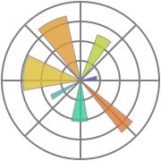
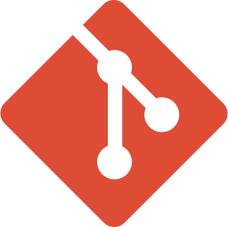

<section id="content">

# <a id="education_ru" href="#education_ru">🎓 Образование</a>
   
   Лицей информационных технологий "ЛИТ" 1533

# <a id="skills_ru" href="#skills_ru">🛠️ Hard skills</a>

* ### Основной стек
    Python, C++, Java, HTML, CSS
    

      
      
      
      
      
      
    

* ### Другое
    Git, GitHub — системы контроля версий.
    

      
      
    

# <a id="projects_ru" href="#projects_ru">🧩 Публичные проекты </a>
Находятся в репозиториях.

# <a id="contacts_ru" href="#contacts_ru">📧 Контакты</a>
* Телеграм: [@commChe](https://t.me/commChe)
* Профиль на [GitHub](https://github.com/commChe-ndrw)

</section>
